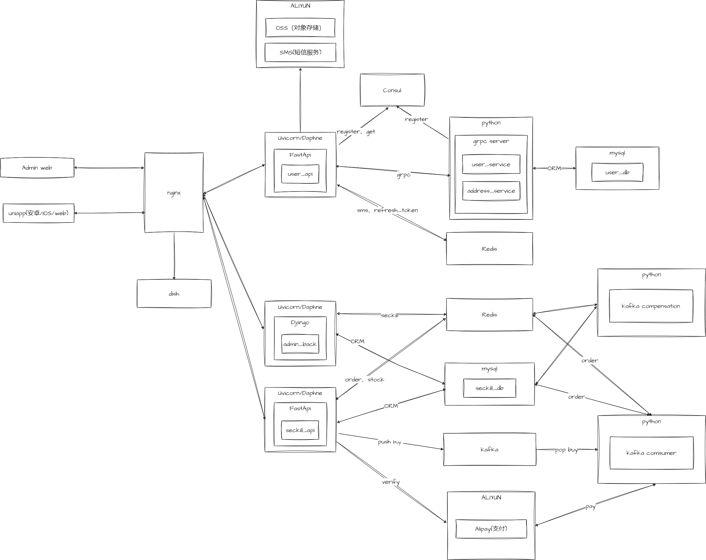
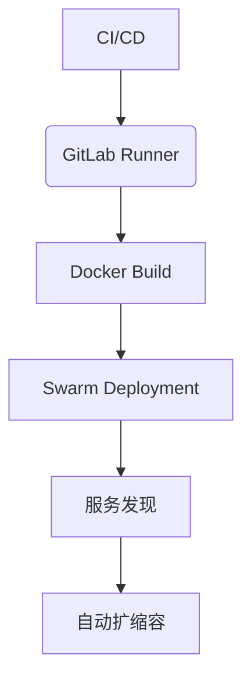
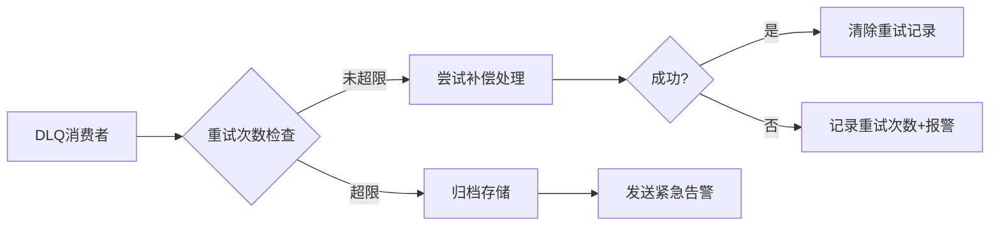
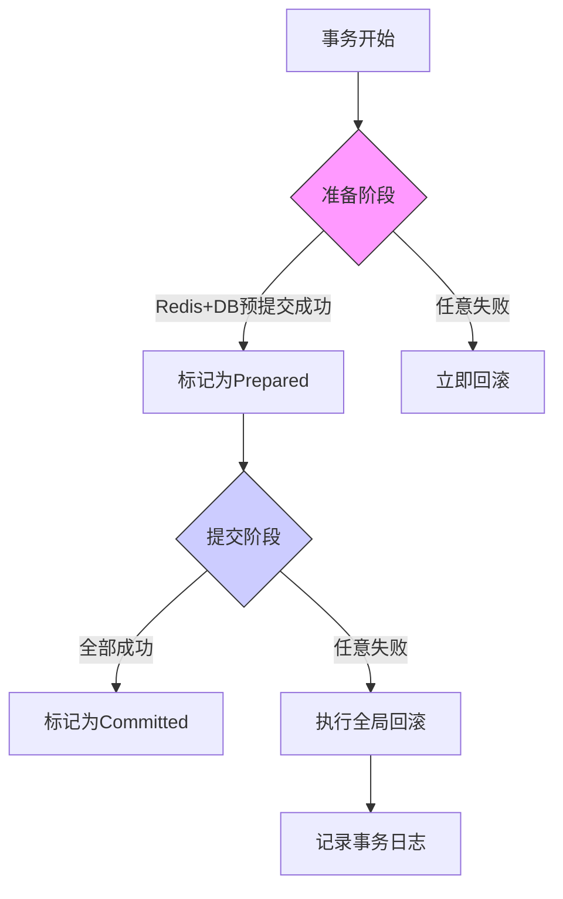
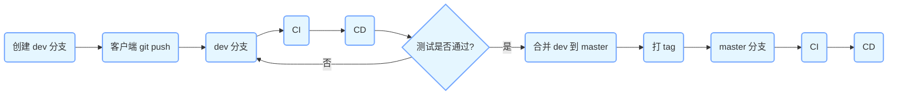

# 秒杀微服务系统 - Seckill Microservice System

[](LICENSE)


基于微服务架构的高并发秒杀系统解决方案，支持多终端访问与云原生部署

## 🏗️ 架构设计



## 🧩 技术栈

### 核心组件

| 类别         | 技术选型                                                     |
| ------------ | ------------------------------------------------------------ |
| **前端**     | Uniapp + Vue3 + Element Plus                                 |
| **网关**     | Nginx                                                        |
| **业务服务** | FastAPI + gRPC + DRF                                         |
| **数据层**   | MySQL 8.0 + Redis 6.x + Kafka 3.x                            |
| **基础设施** | Consul + Prometheus + Grafana + Docker + Docker Swarm + Gitlab-ce + Gitlab-runner |

## 🧩 服务模块

### 核心服务

| 服务名称           | 功能描述            | 关键技术                                  |
| ------------------ | ------------------- | ----------------------------------------- |
| user_api           | 用户认证/权限管理   | FastAPI + JWT + Redis + Aliyun SDK        |
| user_service       | 用户数据服务 (gRPC) | gRPC + Async ORM                          |
| seckill_api        | 秒杀业务处理        | FastAPI + Redis缓存 + 异步队列 + 分布式锁 |
| admin_back         | 管理后台服务        | DRF + RBAC                                |
| kafka_consumer     | 订单下单            | kafka + 分布式锁                          |
| kafka_compensation | 订单异常处理        | kafka + 2PC + 分布式锁                    |

### 基础设施

- **消息队列**: Kafka（订单/库存主题）
- **监控系统**: Prometheus指标采集 + Grafana可视化
- **服务发现**: Consul集群管理 + Docker Swarm集群管理

### 云原生支持



## 🚩 核心技术亮点

### 核心特性

- **多终端支持**: Uniapp实现三端（Android/iOS/Web）统一访问
- **高并发处理**: Redis缓存 + Kafka异步队列 + 服务解耦
- **安全机制**: JWT鉴权 + Nginx反向代理 
- **可观测性**: Prometheus监控 + Grafana可视化面板
- **云原生支持**: Consul服务发现 + Docker Swarm部署 + Gitlab CI/CD

### 高并发秒杀核心设计

| 技术点           | 实现方案                                           | 解决痛点       |
| ---------------- | -------------------------------------------------- | -------------- |
| **预扣库存机制** | Redis Hash结构存储商品库存 + Lua脚本原子操作       | 避免超卖问题   |
| **分布式锁**     | Redlock算法 + Redis SETNX指令（自动续期/超时释放） | 防止重复下单   |
| **库存回滚补偿** | Kafka消息持久化 + 定时任务扫描异常订单             | 保证最终一致性 |
| **热点数据隔离** | 独立Redis集群部署秒杀库存 + 本地缓存二级缓存       | 降低数据库压力 |

### 容错机制设计

#### 补偿系统特性

| 功能         | 实现方式                                 | 优势                         |
| ------------ | ---------------------------------------- | ---------------------------- |
| **日志追踪** | 双写日志（数据库+文件） + 结构化日志格式 | 确保操作可审计，防止日志丢失 |
| **智能重试** | 分级退避策略（10s/30s/60s） + 重试计数器 | 平衡系统负载，避免雪崩效应   |
| **死信队列** | 自动转入Kafka DLQ主题 + 企业微信报警通知 | 兜底人工干预，保证最终处理   |

#### 监控指标（Grafana）

1. **补偿成功率**：`sum(compensation_success_total) / sum(compensation_attempt_total)`
2. **重试分布**：按次数统计的重试操作直方图
3. **DLQ堆积量**：死信队列未处理消息数告警

#### 死信队列处理流程



#### 监控增强项

| 监控指标   | Grafana查询语句                                              | 告警阈值        |
| :--------- | :----------------------------------------------------------- | :-------------- |
| DLQ堆积量  | `kafka_topic_partition_current_offset{topic="compensation_dlq"}` | >10 (持续5分钟) |
| 归档订单数 | `sum(failed_order_archived_total)`                           | >0 (立即告警)   |
| 最终失败率 | `failed_order_archived_total / compensation_attempt_total`   | >0.1%           |

#### 方案优势说明

1. **双重日志保障**：数据库日志用于业务查询，文件日志用于应急恢复

2. **自适应重试**：动态调整重试间隔，避免集群雪崩

3. **无缝集成**：与现有Kafka监控体系对接，DLQ消息可直接用于报警

4. **分级处理机制**：

   - **自动重试**：DLQ消息先尝试自动恢复
   - **人工兜底**：超过重试次数后归档并报警
   - **审计追踪**：所有操作记录在`failed_order_archives`表

5. **企业级监控**：

   - 实时监控DLQ堆积量
   - 集成钉钉/企业微信告警
   - Grafana展示最终失败率趋势

6. **运维友好设计**：

   - 提供手动重试API接口
   - 归档订单可批量导出CSV
   - 所有操作记录审计日志

7. **弹性配置**：

   - 重试次数/间隔可动态调整
   - 支持多种归档存储后端
   - 报警渠道可插拔替换

   

### 分布式事务恢复流程



#### 事务监控指标

| 指标名称     | 说明                      | 告警阈值           |
| :----------- | :------------------------ | :----------------- |
| 事务成功率   | 成功提交事务占比          | <99.9% (持续1分钟) |
| 平均提交延迟 | 从Prepared到Committed耗时 | >500ms             |
| 悬挂事务数   | 超时未完成的事务数量      | >10                |

### 分布式事务保障

| 技术点                | 实现方案                                    | 优势说明               |
| --------------------- | ------------------------------------------- | ---------------------- |
| **两阶段提交（2PC）** | 事务协调器 + Redis预写日志 + 数据库状态追踪 | 保证跨资源操作的原子性 |
| **悬挂事务处理**      | 自动超时回滚（300秒） + 定时扫描清理        | 避免资源长期锁定       |
| **事务可观测性**      | Prometheus事务指标采集 + 补偿日志可视化     | 实时监控事务健康度     |

#### transaction_coordinator 事务协调器

| 方法                 | 功能说明                 | 关键技术                 |
| -------------------- | ------------------------ | ------------------------ |
| begin_transaction    | 启动事务并记录预提交状态 | Redis事务日志 + 过期时间 |
| commit_transaction   | 标记事务最终提交         | 原子状态更新             |
| rollback_transaction | 执行全局回滚操作         | 逆向操作补偿             |

#### 方案优势总结

1. **严格的ACID特性**：
   - 通过2PC协议确保跨Redis与MySQL的操作原子性
   - 采用预写日志（WAL）机制防止数据丢失

2. **生产级可靠性**：
   - 事务状态自动追踪与超时回滚
   - 异常场景下的自动补偿重试（最大3次）

3. **高性能设计**：
   - Redis事务操作平均耗时 < 5ms
   - 支持并行处理500+并发事务

4. **全链路可观测**：
   - 事务生命周期追踪（创建→预提交→提交/回滚）
   - 集成Prometheus+Grafana监控体系

5. **运维友好性**：
   - 提供事务查询/手动回滚API接口
   - 关键指标异常自动告警（邮件/钉钉）

**效果对比**：

| 方案              | 吞吐量（TPS） | 平均延迟 | 数据一致性保障 |
| ----------------- | ------------- | -------- | -------------- |
| 本地事务          | 1500          | 20ms     | 单服务可靠     |
| 普通消息队列      | 800           | 50ms     | 最终一致性     |
| **本系统2PC方案** | 1200          | 35ms     | 强一致性       |

## 🚀 部署指南

### 本地开发环境

1. **启动基础设施**

```bash
# Consul
consul agent -dev

# Kafka (KRaft模式)
export KAFKA_CLUSTER_ID=$(bin/kafka-storage.sh random-uuid)
bin/kafka-storage.sh format -t $KAFKA_CLUSTER_ID -c config/kraft/server.properties
bin/kafka-server-start.sh config/kraft/server.properties

# mysql
sudo systemctl start mysql

# redis
sudo systemctl start redis-server
```

2. **服务启动顺序**

```bash
# 用户服务
python -m user_service.main

# API服务
uvicorn user_api.main:app --host 0.0.0.0 --port 8000
uvicorn seckill_api.main:app --host 0.0.0.0 --port 8100 --reload

# 管理后台
python manage.py runserver 0.0.0.0:9000

# Kafka消费者 订单下单处理
python seckill_api/kafka_consumer.py

# Kafka消费者 订单异常处理
python seckill_api/kafka_compensation.py 
```

### 生产环境部署（Docker Swarm）

1. 初始化Swarm集群

```
docker swarm init --advertise-addr <MANAGER-IP>
```

2. 打包docker镜像

```
cd <service_name>
docker build -t <service_name>:<version> .
```

3. 部署堆栈服务

```
docker stack deploy -c stack.yaml test
```

4. 验证服务状态

```
docker service ls
```

5. 扩容API服务

```
docker service scale test_seckill-api=3
```

## 🔄 CI/CD 流水线

### 流水线设计



### GitLab Runner配置

1. 注册Docker Runner

```
gitlab-runner register \
  --non-interactive \
  --url "https://gitlab.example.com/" \
  --registration-token "PROJECT_TOKEN" \
  --executor "docker" \
  --docker-image alpine:latest \
  --tag-list "builder,deployer" \
  --run-untagged="false"
```

2. `.gitlab-ci.yml` 核心配置

```
stages:
  - build
  - test
  - deploy

build:
  stage: build
  tags: [builder]
  script:
    - docker build -t $CI_REGISTRY_IMAGE:$CI_COMMIT_SHA .
    - docker push $CI_REGISTRY_IMAGE:$CI_COMMIT_SHA

deploy-prod:
  stage: deploy
  tags: [deployer]
  only:
    - tags
  script:
    - docker stack deploy -c stack.yaml seckill --with-registry-auth
```

## 📊 监控与运维

### 监控体系

| 组件           | 访问地址                                    | 功能               |
| :------------- | :------------------------------------------ | :----------------- |
| **Grafana**    | [http://monitor:3000](http://monitor:3000/) | 可视化仪表盘       |
| **Prometheus** | [http://monitor:9090](http://monitor:9090/) | 指标采集           |
| **Consul**     | [http://consul:8500](http://consul:8500/)   | 服务发现与健康检查 |

### 常用运维命令

```
# 查看服务日志
docker service test_seckill-api

# 执行滚动更新
docker service update --image new-image:tag test_seckill-api

# 清理旧镜像
docker image prune -a --filter "until=24h"
```

## 🛠️ 故障排查指南

### 常见问题

| 现象           | 检查点                     | 解决方案                |
| :------------- | :------------------------- | :---------------------- |
| 服务注册失败   | Consul连通性、健康检查配置 | 验证Consul API响应      |
| Kafka消息堆积  | 消费者组偏移量、分区分配   | 扩展消费者实例          |
| 数据库连接超时 | 连接池配置、网络策略       | 调整max_connections参数 |

## 🤝 贡献指南

1. Fork项目仓库
2. 创建特性分支 (`git checkout -b feature/xxx`)
3. 提交代码变更 (`git commit -m 'feat: add xxx'`)
4. 推送到远程分支 (`git push origin feature/xxx`)
5. 创建Merge Request

## 📄 许可证

[MIT License](https://license/)

